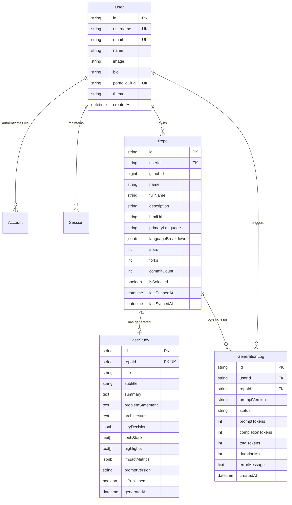

# AI GitHub Portfolio Generator

> Turn raw GitHub repositories into recruiter-ready engineering case studies with structured AI generation, bespoke editorial design, and zero generic templates.

---

## Overview

AI GitHub Portfolio Generator transforms developer GitHub profiles into high-signal engineering portfolios. Unlike generic portfolio templates, it inspects your real codebase (commit history, README context, language breakdowns), crafts structured engineering case studies (Problem → Approach → Architecture → Impact), and renders them in a human-crafted editorial layout.

---

## Database Schema

The database is built on **PostgreSQL** via **Prisma ORM**, optimized for Neon/Supabase serverless connection pooling. It features a clean entity-relationship model that supports OAuth authentication, repository metadata synchronization, AI case-study persistence, and granular generation quota tracking.

### Model Architecture Rationale

| Model | Purpose & Architectural Significance |
|---|---|
| **`User`** | Stores developer identity, custom portfolio slug (`/[username]`), theme selection, and editorial headline. |
| **`Repo`** | Caches synced GitHub repository metadata, language byte distributions, commit statistics, and sync timestamps to minimize GitHub API rate-limit consumption. |
| **`CaseStudy`** | Stores high-signal, Zod-validated engineering case studies (Problem, Architecture, Key Decisions, Tech Stack, Highlights, Impact Metrics) generated by Gemini. |
| **`GenerationLog`** | Tracks every AI prompt execution, token usage, duration, status (`SUCCESS`, `SKIPPED_CACHE`, `RATE_LIMITED`), and prompt version. Critical for protecting free-tier quota and debugging model drift. |
| **`Account` / `Session`** | Standard NextAuth / Auth.js models ensuring seamless GitHub OAuth token persistence for extended repository fetching. |

---

## Progress Checklist

- [x] **Phase 0** — Project scaffolding (Next.js 15 + TypeScript + Tailwind + App Router + ESLint + Prettier)
- [x] **Phase 1** — Database schema & Prisma setup (User, Repo, CaseStudy, GenerationLog)
- [ ] **Phase 2** — Environment variable validation with Zod
- [ ] **Phase 3** — Git hooks (Husky + lint-staged) & Commitlint configuration
- [ ] **Phase 4** — CI pipeline via GitHub Actions (Lint, Type-check, Build)
- [ ] **Phase 5** — Prisma client singleton & Postgres connection pool
- [ ] **Phase 6** — Database migrations & relational integrity rules
- [ ] **Phase 7** — Database seed script with realistic engineering test cases
- [ ] **Phase 8** — NextAuth (Auth.js) core configuration with Prisma adapter
- [ ] **Phase 9** — GitHub OAuth provider integration & scope handling
- [ ] **Phase 10** — Server and client session helpers
- [ ] **Phase 11** — Protected route middleware (`/dashboard/*`)
- [ ] **Phase 12** — Sign-in and sign-out UI components
- [ ] **Phase 13** — Octokit client setup with rate-limit and auth handling
- [ ] **Phase 14** — GitHub user profile & repository list fetching
- [ ] **Phase 15** — Repository README fetching and markdown context extraction
- [ ] **Phase 16** — Repository commit history & commit activity statistics
- [ ] **Phase 17** — Repository language bytes breakdown & percentage computation
- [ ] **Phase 18** — Repository persistence & upsert pipeline in PostgreSQL
- [ ] **Phase 19** — Google Gemini API client setup with structured JSON mode
- [ ] **Phase 20** — Multi-angle case study prompt engineering (Problem / Architecture / Impact)
- [ ] **Phase 21** — Strict Zod output schema definition & runtime validation
- [ ] **Phase 22** — Case study generation Server Action with prompt versioning
- [ ] **Phase 23** — API usage tracking & audit trail via `GenerationLog`
- [ ] **Phase 24** — Smart caching & skip-generation check for unchanged repos
- [ ] **Phase 25** — Rate-limit protection & quota management for Gemini free tier
- [ ] **Phase 26** — Batch generation pipeline for multiple repositories
- [ ] **Phase 27** — Design exploration via Stitch MCP (editorial vs technical vs minimal)
- [ ] **Phase 28** — Design system token extraction & DESIGN.md documentation
- [ ] **Phase 29** — Typography pairing (editorial serif + technical mono) & base styles
- [ ] **Phase 30** — Core UI components (buttons, tags, inputs, alerts)
- [ ] **Phase 31** — Layout components (asymmetric grid, containers, headers)
- [ ] **Phase 32** — Motion system (staggered entrance, scroll reveals, micro-interactions)
- [ ] **Phase 33** — Loading skeletons matching exact content geometry
- [ ] **Phase 34** — Dashboard layout shell & responsive navigation
- [ ] **Phase 35** — Dashboard repository list view with sync statuses
- [ ] **Phase 36** — GitHub repository sync action with real-time feedback
- [ ] **Phase 37** — Case study preview card with inline manual overrides
- [ ] **Phase 38** — Generation control center (single, batch, force-regenerate)
- [ ] **Phase 39** — API quota and token usage dashboard meter
- [ ] **Phase 40** — User settings & custom portfolio slug management
- [ ] **Phase 41** — Public portfolio dynamic route `/[username]` data loading
- [ ] **Phase 42** — Asymmetric editorial portfolio hero section
- [ ] **Phase 43** — Case study presentation cards with tech badges
- [ ] **Phase 44** — Case study deep-dive view (Problem, Architecture, Impact, Code highlights)
- [ ] **Phase 45** — Empty states, 404 handler, and error recovery boundaries
- [ ] **Phase 46** — Dynamic OpenGraph image generation via `@vercel/og`
- [ ] **Phase 47** — Social preview meta tags (Twitter cards, LinkedIn tags)
- [ ] **Phase 48** — Portfolio sharing modal with one-click copy and QR code
- [ ] **Phase 49** — End-to-end Server Action input validation with Zod
- [ ] **Phase 50** — Accessibility audit (ARIA landmarks, WCAG AA contrast, keyboard navigation)
- [ ] **Phase 51** — Performance optimization (dynamic imports, image caching, font preload)
- [ ] **Phase 52** — Database index tuning & query optimization
- [ ] **Phase 53** — Production SEO setup (JSON-LD structured data, dynamic sitemap, robots.txt)
- [ ] **Phase 54** — Architecture documentation & interactive pipeline diagrams
- [ ] **Phase 55** — Production deployment configuration, smoke testing, and final polish
